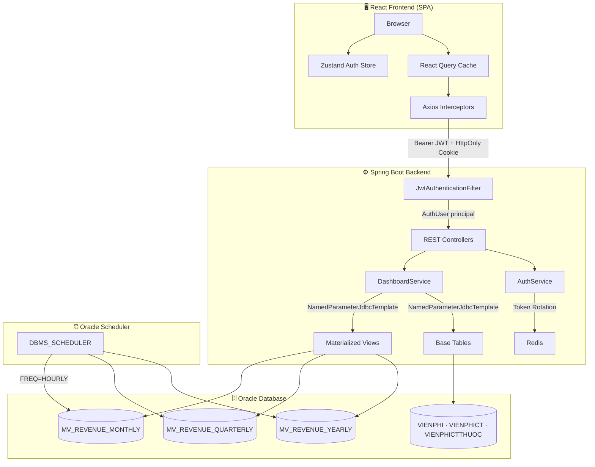
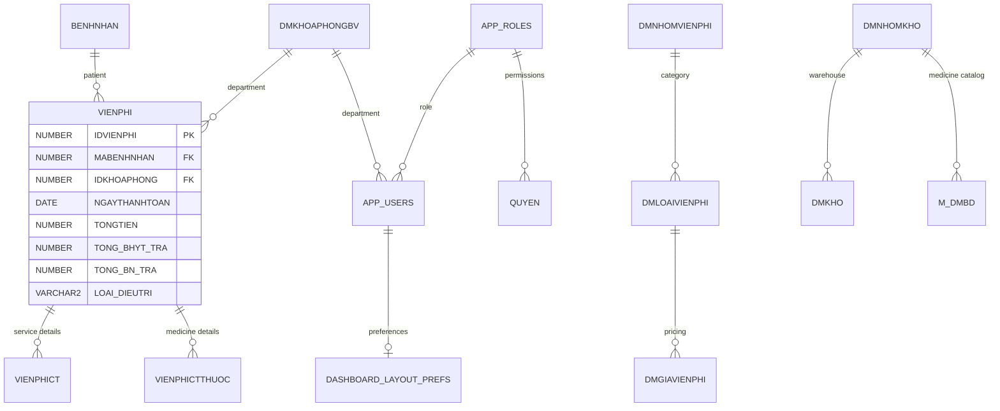
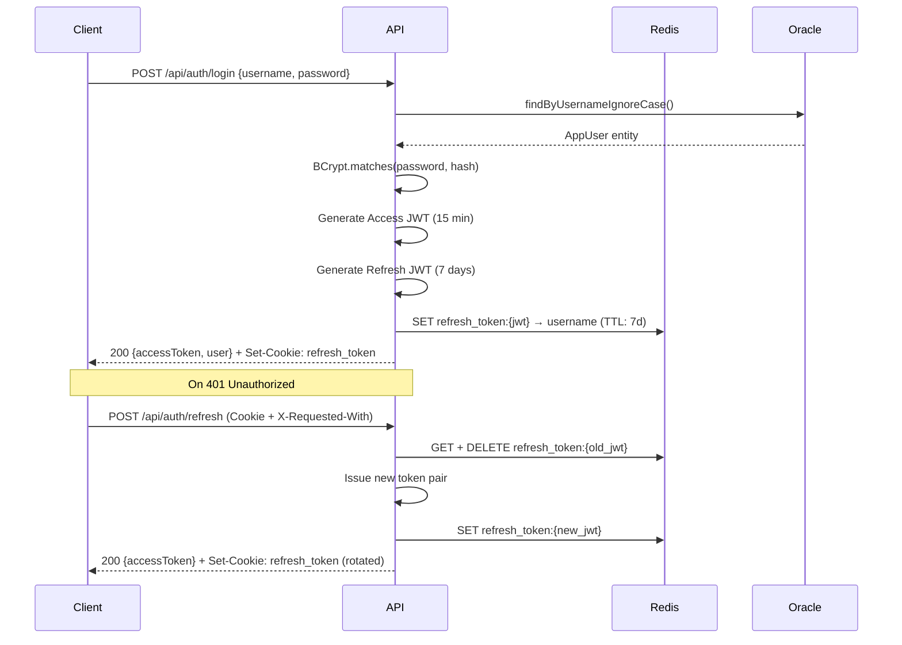

<p align="center">
  
  
  
  
  
  
  
</p>

# 🏥 BV Nguyễn Tri Phương — Oracle Live Dashboard

> A full-stack, real-time hospital business intelligence dashboard that transforms raw Oracle billing data into actionable executive insights — built with Spring Boot, React, and custom SVG visualizations.

---

## Problem Statement

Hospital administrators at **BV Nguyễn Tri Phương** need to monitor financial performance, patient throughput, insurance coverage ratios, and department-level comparisons — all in real time. Without a centralized dashboard, operational decisions are delayed by manual data extraction from Oracle ERP systems.

This project delivers a **role-based, secure, and responsive** BI dashboard that connects directly to the hospital's Oracle database, aggregates billing data through materialized views, and renders interactive charts for three distinct user roles.

### Target Users

| Role | Access Level | Use Case |
|:---|:---|:---|
| **Giám đốc** (Director) | Full hospital view, all departments | Strategic planning, cross-department comparison |
| **Trưởng khoa** (Department Head) | Own department only | Departmental performance monitoring |
| **Bác sĩ** (Doctor) | Own department, no financial data | Operational throughput metrics |

---

## Key Features

- 📊 **4 Executive KPI Cards** — Patients, visits, revenue, bed occupancy
- 📈 **Revenue Trend Charts** — Monthly, quarterly, yearly with bar/line toggle
- 🍩 **Donut Charts** — Service vs. medicine ratio, inpatient vs. outpatient, BHYT vs. self-pay
- 📋 **Stacked Bar Rankings** — Top 10 departments by revenue with payer breakdown
- 🔐 **JWT + Redis Auth** — Stateless access tokens + rotated refresh tokens in HttpOnly cookies
- 👥 **Role-Based Access Control** — Spring Security + frontend route guards
- ⚡ **Materialized Views** — Hourly-refreshed pre-aggregated queries for subsecond rendering
- 🎨 **Custom SVG Charts** — Zero external chart libraries, fully responsive

---

## Dashboard Preview

> **Note:** Add your own screenshots to a `docs/images/` directory.

| Page | Description |
|:---|:---|
|  | Main dashboard with KPI cards, revenue trend chart, department comparison, and ratio donuts |
|  | BHYT analysis with treatment type and payment source breakdowns |
|  | Secure authentication portal with Vietnamese localization |

---

## System Architecture



### Architecture Decisions

| Decision | Rationale |
|:---|:---|
| **NamedParameterJdbcTemplate** over JPA for analytics | Avoids ORM overhead on read-heavy aggregate queries |
| **Custom SVG charts** over Chart.js/D3 | Eliminates 200KB+ dependency, full control over animations |
| **Zustand** over Redux | Minimal boilerplate for auth state management |
| **React Query** for server state | Automatic caching, background refetching, stale-while-revalidate |
| **Redis** for refresh tokens | Single-use token rotation with automatic TTL expiration |

---

## Technology Stack

| Layer | Technology | Version | Purpose |
|:---|:---|:---:|:---|
| **Database** | Oracle Database | — | OLTP storage, materialized views, DBMS_SCHEDULER |
| **Backend** | Spring Boot | 3.5.0 | REST API, security, business logic |
| **Language** | Java | 21 | Backend runtime |
| **ORM** | Spring Data JPA + JDBC | — | Entity management + native analytical queries |
| **Auth Tokens** | JJWT | 0.12.7 | JWT generation, signing (HMAC-SHA), and validation |
| **Session Cache** | Redis | — | Refresh token storage with TTL |
| **Frontend** | React | 19.2 | Component-based UI |
| **Type System** | TypeScript | 6.0 | Static typing across frontend |
| **State** | Zustand | 5.0 | Lightweight global auth state |
| **Data Fetching** | TanStack React Query | 5.x | Server state management |
| **HTTP Client** | Axios | 1.13 | API calls with interceptors |
| **Routing** | React Router | 7.9 | Client-side navigation |
| **Build Tool** | Vite | 8.0 | Frontend bundling and HMR |
| **Build Tool** | Maven | — | Backend build and dependency management |
| **Visualization** | Custom SVG | — | TrendChart, DonutChart, StackedBarChart |

---

## Database Design

### Core Schema (20 Tables)



### Materialized Views

| View | Aggregation | Grouped By | Index |
|:---|:---|:---|:---|
| `MV_REVENUE_MONTHLY` | `SUM(TONGTIEN)` | `TRUNC(NGAYTHANHTOAN, 'MM')`, `IDKHOAPHONG` | `IDX_MV_MONTHLY_DEPT` |
| `MV_REVENUE_QUARTERLY` | `SUM(TONGTIEN)` | `NAMQUY`, `IDKHOAPHONG` | `IDX_MV_QUARTERLY_DEPT` |
| `MV_REVENUE_YEARLY` | `SUM(TONGTIEN)` | `EXTRACT(YEAR)`, `IDKHOAPHONG` | `IDX_MV_YEARLY_DEPT` |

**Refresh Strategy:** `DBMS_SCHEDULER` job runs `FREQ=HOURLY;BYMINUTE=0`, executing `DBMS_MVIEW.REFRESH` on all three views.

### Base Table Indexes

| Index | Table | Column(s) |
|:---|:---|:---|
| `IDX_VIENPHI_TIME` | `VIENPHI` | `NGAYTHANHTOAN` |
| `IDX_VIENPHI_KHOA` | `VIENPHI` | `IDKHOAPHONG` |
| `IDX_VIENPHI_NAMQUY` | `VIENPHI` | `NAMQUY` |
| `IDX_CT_VP` | `VIENPHICT` | `IDVIENPHI` |
| `IDX_CT_DV` | `VIENPHICT` | `IDGIAVIENPHI` |
| `IDX_CT_THUOC` | `VIENPHICTTHUOC` | `IDVIENPHI` |

---

## Backend Architecture

### Package Structure

```
backend/src/main/java/com/hospital/dashboard/
├── auth/                    # Authentication & authorization
│   ├── AuthController.java      # POST /login, /refresh, /logout
│   ├── AuthService.java         # Login, token issuance, cookie builder
│   ├── JwtService.java          # JWT generation & validation (HMAC-SHA)
│   ├── JwtAuthenticationFilter  # OncePerRequestFilter for JWT parsing
│   ├── RefreshTokenService.java # Redis-backed token rotation
│   ├── AppUser.java             # JPA entity → APP_USERS
│   ├── AppRole.java             # JPA entity → APP_ROLES
│   └── AuthUser.java            # Spring Security principal
├── config/
│   ├── SecurityConfig.java      # Filter chain, CORS, RBAC rules
│   ├── DataInitializer.java     # Default admin user seeder
│   └── AppProperties.java       # Typed config (JWT secret, CORS origins)
├── dashboard/
│   ├── DashboardController.java # GET /snapshot, /revenue, /analysis
│   └── DashboardService.java    # SQL aggregation, KPI calculations
├── department/
│   ├── DepartmentController.java # GET /departments
│   └── Department.java          # JPA entity → DMKHOAPHONGBV
├── layout/
│   ├── LayoutController.java    # GET/PUT /layout
│   └── LayoutService.java       # User layout preference persistence
└── common/
    ├── GlobalExceptionHandler.java  # Centralized error responses
    └── ApiError.java               # Standardized error DTO
```

### Authentication Flow



### Security Configuration

| Endpoint | Access |
|:---|:---|
| `POST /api/auth/**` | Public |
| `GET /api/dashboard/revenue` | `DIRECTOR`, `DEPARTMENT_HEAD` |
| `GET /api/dashboard/**` | `DIRECTOR`, `DEPARTMENT_HEAD`, `DOCTOR` |
| `GET /api/departments` | Authenticated |
| `GET/PUT /api/layout` | Authenticated |

---

## Frontend Architecture

### Folder Structure

```
frontend/src/
├── views/                 # Route-level pages
│   ├── DashboardPage.tsx      # Main dashboard with KPIs, charts, filters
│   ├── ReportPage.tsx         # BHYT & treatment analysis
│   ├── LoginPage.tsx          # Authentication form
│   └── UnauthorizedPage.tsx   # 403 fallback
├── ui/                    # Shared components
│   ├── AppShell.tsx           # Sidebar + main layout wrapper
│   ├── ProtectedRoute.tsx     # Role-based route guard
│   ├── AuthBootstrap.tsx      # Session restoration on app load
│   ├── KpiCard.tsx            # KPI indicator card
│   ├── RevenuePanel.tsx       # Revenue chart + type switcher
│   └── charts/
│       ├── TrendChart.tsx     # Custom SVG bar/line chart
│       ├── DonutChart.tsx     # Custom SVG donut with legend
│       ├── StackedBarChart.tsx # Horizontal stacked bars
│       └── ChartTypeSwitcher.tsx
├── services/
│   ├── api.ts                 # Axios instance + interceptors
│   ├── authService.ts         # login(), refresh(), logout()
│   └── dashboardService.ts    # fetchSnapshot(), fetchAnalysis()
├── stores/
│   └── authStore.ts           # Zustand global auth state
├── hooks/
│   └── useChart.ts            # Chart type toggle state
├── types.ts                   # Shared TypeScript interfaces
├── router.tsx                 # React Router v7 configuration
└── styles.css                 # Global CSS with design tokens
```

### Key Frontend Patterns

- **Silent Token Refresh:** Axios response interceptor catches 401 errors, queues concurrent requests, refreshes the token once, then replays all queued requests.
- **Session Bootstrap:** `AuthBootstrap` attempts a cookie-based refresh on app load before rendering any protected route.
- **Role-Based UI:** Directors see a department filter dropdown; Doctors and Department Heads are locked to their assigned department.

---

## Dashboard Features

### 1. Executive KPI Cards

| KPI | Calculation | Visualization |
|:---|:---|:---|
| **Tổng bệnh nhân** | `COUNT(DISTINCT MABENHNHAN)` | Numeric card |
| **Số lượt điều trị** | `COUNT(*)` from VIENPHI | Numeric card |
| **Doanh thu** | `SUM(TONGTIEN)` + average per visit | Currency card |
| **Công suất giường** | `(inpatients / capacity) × 100` | Percentage card |

### 2. Revenue Trend Chart

Interactive bar/line chart showing revenue over time. Reads from materialized views:
- **Tháng (Month):** Last 12 months from `MV_REVENUE_MONTHLY`
- **Quý (Quarter):** Last 8 quarters from `MV_REVENUE_QUARTERLY`
- **Năm (Year):** All years from `MV_REVENUE_YEARLY`

### 3. Service vs. Medicine Ratio (Donut)

Aggregates `SUM(SOTIEN)` from `VIENPHICT` (services) and `VIENPHICTTHUOC` (medicines) to show the billing composition as a percentage donut chart.

### 4. Top 10 Department Comparison (Stacked Bar)

Horizontal stacked bars showing BHYT vs. patient self-pay amounts per department, sorted by total revenue descending.

### 5. BHYT & Treatment Analysis (Reports Page)

- **Inpatient vs. Outpatient ratio** donut chart
- **BHYT vs. Self-Pay ratio** donut chart
- **Top 10 departments** stacked bar (same component, scoped by period)

---

## API Documentation

| Method | Endpoint | Description | Auth |
|:---|:---|:---|:---:|
| `POST` | `/api/auth/login` | Authenticate and receive JWT + cookie | ❌ |
| `POST` | `/api/auth/refresh` | Rotate refresh token (requires `X-Requested-With` header) | 🍪 |
| `POST` | `/api/auth/logout` | Invalidate refresh token | 🍪 |
| `GET` | `/api/dashboard/snapshot` | Full dashboard snapshot (KPIs, revenue, ratios, rankings) | 🔑 |
| `GET` | `/api/dashboard/revenue` | Revenue trend data (Directors/Dept Heads only) | 🔑 |
| `GET` | `/api/dashboard/analysis` | Treatment and payment analysis | 🔑 |
| `GET` | `/api/departments` | List all departments | 🔑 |
| `GET` | `/api/layout` | Get user's layout preferences | 🔑 |
| `PUT` | `/api/layout` | Save user's layout preferences | 🔑 |

**Legend:** ❌ = Public | 🍪 = Cookie-based | 🔑 = Bearer JWT

### Query Parameters

| Parameter | Type | Default | Used By |
|:---|:---|:---|:---|
| `period` | `month` \| `quarter` \| `year` | `month` | `/snapshot`, `/revenue`, `/analysis` |
| `departmentId` | `number` | `null` (all) | `/snapshot`, `/revenue`, `/analysis` |

---

## Installation Guide

### Prerequisites

- **Java 21** (OpenJDK or Oracle JDK)
- **Oracle Database** (21c+ with PDB support)
- **Redis** (6.0+)
- **Node.js** (20+) with npm
- **Maven** (3.9+)

### 1. Clone the Repository

```bash
git clone https://github.com/hoangdeptrai1010/NTP_DASHBOARD.git
cd NTP_DASHBOARD
```

### 2. Database Setup

```bash
# Connect to Oracle as DBA
sqlplus sys@//localhost:1521/orclpdb as sysdba

# Create dashboard schema user
CREATE USER dashboard IDENTIFIED BY dashboard;
GRANT CONNECT, RESOURCE, CREATE MATERIALIZED VIEW TO dashboard;
GRANT CREATE JOB TO dashboard;
ALTER USER dashboard QUOTA UNLIMITED ON USERS;

# Connect as dashboard user and run scripts
sqlplus dashboard/dashboard@//localhost:1521/orclpdb
@dashboard.sql
@seed_data.sql
```

### 3. Backend Setup

```bash
cd backend

# Configure environment (optional — defaults work for local dev)
export DB_URL=jdbc:oracle:thin:@//localhost:1521/orclpdb
export DB_USER=dashboard
export DB_PASS=dashboard
export REDIS_HOST=localhost

# Build and run
./mvnw spring-boot:run
```

The API will start on `http://localhost:8081`.

### 4. Frontend Setup

```bash
cd frontend

npm install

# Optional: configure API base URL
echo "VITE_API_BASE_URL=http://localhost:8081" > .env

npm run dev
```

The UI will open at `http://localhost:5173`.

### 5. Default Login

| Username | Password | Role |
|:---|:---|:---|
| `admin` | `admin` | Director |

> Additional users should be created directly in the Oracle `APP_USERS` table with BCrypt-hashed passwords.

---

## Performance Optimizations

| Technique | Implementation | Impact |
|:---|:---|:---|
| **Materialized Views** | 3 pre-aggregated views for monthly/quarterly/yearly revenue | Subsecond chart rendering |
| **Composite Indexes** | Indexes on MV filter columns (`IDKHOAPHONG`, `THANG`, `NAMQUY`, `NAM`) | Eliminates full scans on filtered queries |
| **Base Table Indexes** | 6 indexes on `VIENPHI`, `VIENPHICT`, `VIENPHICTTHUOC` | Faster KPI aggregation queries |
| **React Query** | `staleTime` + background refetching | Cached data with silent updates |
| **Axios Interceptor Queue** | Deduplicates concurrent token refreshes | Prevents refresh token race conditions |
| **Zero Chart Dependencies** | Custom SVG components (~5KB total) | No Chart.js/D3 bundle overhead |

---

## Security

| Feature | Implementation |
|:---|:---|
| **Password Hashing** | BCrypt with strength 12 |
| **Access Tokens** | JWT signed with HMAC-SHA, 15-minute expiry |
| **Refresh Tokens** | JWT stored in Redis, single-use rotation, 7-day TTL |
| **Cookie Security** | `HttpOnly`, `Secure`, `SameSite=Lax`, `Path=/api/auth` |
| **CSRF Mitigation** | `X-Requested-With: XMLHttpRequest` header required on cookie endpoints |
| **RBAC** | Spring Security `hasAnyRole()` + service-layer authorization checks |
| **SQL Injection** | `NamedParameterJdbcTemplate` with parameterized queries |
| **XSS** | React's default output escaping, no `dangerouslySetInnerHTML` |
| **CORS** | Profile-specific allowed origins (dev: `localhost:5173`, prod: `dashboard.hospital.vn`) |
| **Secrets** | Production JWT secret loaded from `${JWT_SECRET}` environment variable |

---

## Testing

### Backend Tests

```
backend/src/test/java/com/hospital/dashboard/
├── auth/
│   └── AuthControllerTest.java       # CSRF header enforcement, refresh/logout flows
└── dashboard/
    ├── DashboardControllerTest.java   # RBAC verification (401, 403, 200)
    └── DashboardServiceTest.java      # Revenue access control, department scoping
```

```bash
cd backend
./mvnw test
```

### Test Coverage

| Area | Tests | Covers |
|:---|:---:|:---|
| Auth Controller | 3 | CSRF enforcement on refresh and logout |
| Dashboard Controller | 3 | 401 without auth, 403 for DOCTOR, pass for DIRECTOR |
| Dashboard Service | 3 | Revenue denial for DOCTOR, permission for DIRECTOR, department scoping |

---

## Future Improvements

- [ ] Read JWT claims directly in the filter (avoid per-request DB lookup)
- [ ] Add ALOS (Average Length of Stay) and Bed Turnover Rate KPIs
- [ ] Interactive date range selector with start/end date pickers
- [ ] Chart drill-down (click a department to filter revenue)
- [ ] Dynamic bed capacity from database instead of hardcoded values
- [ ] Change password endpoint and UI
- [ ] Export dashboard to PDF/Excel
- [ ] WebSocket push for real-time data updates

---

## Lessons Learned

### Technical

- **Oracle Materialized Views** significantly reduce analytical query latency — but require careful index planning on the views themselves, not just the base tables.
- **Custom SVG charts** offer complete design control but require careful handling of edge cases (empty data, single data points).
- **JWT + Redis token rotation** provides a robust balance between stateless authentication and revocation capability.

### Architecture

- Separating analytical queries (JDBC) from CRUD operations (JPA) within the same Spring Boot application prevents ORM abstraction leakage for complex SQL.
- Role-based data scoping must be enforced at the **service layer**, not just at the endpoint level — multiple endpoints may share internal methods.

### Business Intelligence

- Hospital BI requires domain-specific KPIs (bed occupancy, BHYT coverage ratios) that differ fundamentally from standard business dashboards.
- Vietnamese-language localization across the entire stack (Oracle column names, API labels, UI text) introduces translation friction that must be managed deliberately.

---

## Author

| | |
|:---|:---|
| **Name** | Hoang Nguyen |
| **GitHub** | [@hoangdeptrai1010](https://github.com/hoangdeptrai1010) |
| **LinkedIn** | [Your LinkedIn Profile](#) |
| **Email** | [your.email@example.com](mailto:your.email@example.com) |
| **Portfolio** | [Your Portfolio URL](#) |

> Update the placeholder links above with your actual profile URLs.

---

## License

This project is licensed under the [MIT License](LICENSE).

```
MIT License

Copyright (c) 2026 Hoang Nguyen

Permission is hereby granted, free of charge, to any person obtaining a copy
of this software and associated documentation files (the "Software"), to deal
in the Software without restriction, including without limitation the rights
to use, copy, modify, merge, publish, distribute, sublicense, and/or sell
copies of the Software, and to permit persons to whom the Software is
furnished to do so, subject to the following conditions:

The above copyright notice and this permission notice shall be included in all
copies or substantial portions of the Software.

THE SOFTWARE IS PROVIDED "AS IS", WITHOUT WARRANTY OF ANY KIND, EXPRESS OR
IMPLIED, INCLUDING BUT NOT LIMITED TO THE WARRANTIES OF MERCHANTABILITY,
FITNESS FOR A PARTICULAR PURPOSE AND NONINFRINGEMENT.
```
